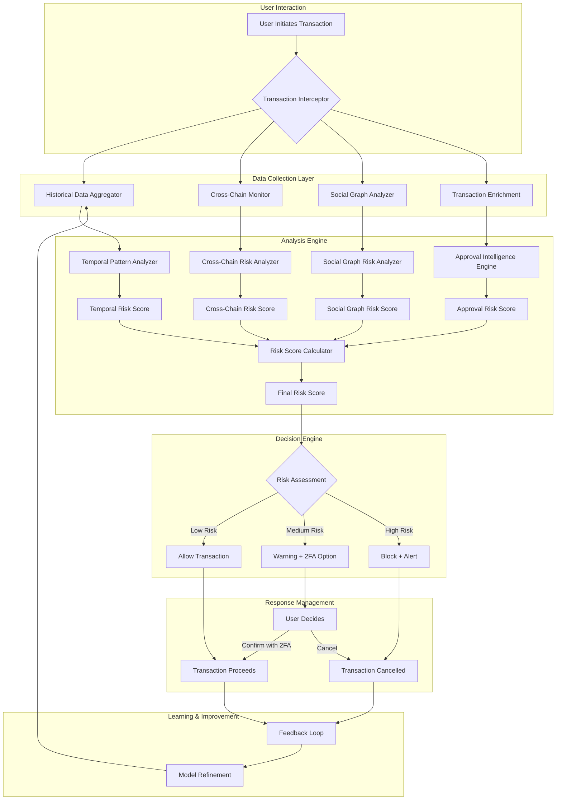

```mermaid
flowchart TD
    subgraph "User Interaction"
        A[User Initiates Transaction] --> B{Transaction Interceptor}
    end

    subgraph "Data Collection Layer"
        B --> C[Historical Data Aggregator]
        B --> D[Cross-Chain Monitor]
        B --> E[Social Graph Analyzer]
        B --> F[Transaction Enrichment]
    end

    subgraph "Analysis Engine"
        C --> G[Temporal Pattern Analyzer]
        D --> H[Cross-Chain Risk Analyzer]
        E --> I[Social Graph Risk Analyzer]
        F --> J[Approval Intelligence Engine]
        
        G --> K[Temporal Risk Score]
        H --> L[Cross-Chain Risk Score]
        I --> M[Social Graph Risk Score]
        J --> N[Approval Risk Score]
        
        K --> O[Risk Score Calculator]
        L --> O
        M --> O
        N --> O
        
        O --> P[Final Risk Score]
    end

    subgraph "Decision Engine"
        P --> Q{Risk Assessment}
        Q -->|Low Risk| R[Allow Transaction]
        Q -->|Medium Risk| S[Warning + 2FA Option]
        Q -->|High Risk| T[Block + Alert]
    end

    subgraph "Response Management"
        R --> U[Transaction Proceeds]
        S --> V[User Decides]
        V -->|Confirm with 2FA| U
        V -->|Cancel| W[Transaction Cancelled]
        T --> W
    end

    subgraph "Learning & Improvement"
        U --> X[Feedback Loop]
        W --> X
        X --> Y[Model Refinement]
        Y --> C
    end
```